# Project Specifications: Giza Open Strategies

> **Purpose:** MVP/experimental implementation showcasing ERC-8004 agent discovery and X402 payment-gated APIs

---

## Glossary

| Term | Alias | Description |
|------|-------|-------------|
| **Giza Agent** | Client Agent | Agent that discovers and consumes services |
| **Memecoin Strategy** | Service Agent | Agent that provides trading signals (paid service) |
| **StrategyRegistry** | Identity Registry | ERC-8004 Identity Registry (agents as ERC-721 NFTs) |
| **StrategyReputation** | Reputation Registry | ERC-8004 Reputation Registry (feedback & ratings) |
| **Indexer** | - | Off-chain service (Ponder) that indexes events and provides discovery API |

---

## Architecture Overview

```
┌─────────────────────┐
│  Service Agent      │
│  (Memecoin Strategy)│
│  - Hono server      │
│  - X402 middleware  │
│  - WebSocket        │
└──────────┬──────────┘
           │
           │ registers in
           ▼
┌─────────────────────┐      emits events      ┌─────────────────────┐
│  StrategyRegistry   │◄─────────────────────►│      Indexer        │
│  (ERC-8004 Identity)│                        │      (Ponder)       │
└─────────────────────┘                        │  - Listens to events│
                                               │  - Builds discovery │
┌─────────────────────┐      emits events      │    API              │
│  StrategyReputation │◄─────────────────────►└──────────┬──────────┘
│  (ERC-8004 Feedback)│                                   │
└─────────────────────┘                                   │ queries
                                                          │
                                               ┌──────────▼──────────┐
                                               │   Client Agent      │
                                               │   (Giza Agent)      │
                                               │   - Discovery       │
                                               │   - X402 payment    │
                                               │   - Signal consumer │
                                               └─────────────────────┘
```

---

## Component Specifications

### 1. Client Agent (Giza Agent)

**Purpose:** Discovers service agents, pays for access, consumes signals, and provides feedback.

**Tech Stack:**
- Bun runtime
- axios (with x402-axios interceptor)
- viem (for wallet operations)
- WebSocket client

**Core Functionality:**

#### 1.1 Agent Discovery
- Query Indexer API: `GET /agents?tags=memecoin,trading&minReputation=80`
- Parse response to get list of agents with reputation scores
- Select agent with best reputation or specific criteria

#### 1.2 X402 Payment & Session Acquisition
- Use **x402-axios interceptor** (auto-handles 402 responses)
- Make POST /sessions request to selected Service Agent
- Interceptor automatically:
  - Detects 402 response
  - Signs payment authorization with wallet
  - Retries request with X-PAYMENT header
- Receive session key on successful payment

#### 1.3 WebSocket Connection
- Establish WebSocket connection using session key
- Listen for signals from Service Agent
- Log received signals (no execution needed for MVP)

#### 1.4 Feedback Submission
- After interaction, submit feedback to StrategyReputation
- Call `giveFeedback(agentId, score, tag1, tag2, feedbackAuth)`
- feedbackAuth provided by Service Agent during payment flow

**Things NOT to do:**
- No AI/LLM integration needed
- No actual signal execution (just log them)
- No complex error handling beyond basic retry

**Environment Variables:**
```env
PRIVATE_KEY=0x...
INDEXER_API_URL=http://localhost:42069
RPC_URL=https://sepolia.base.org
STRATEGY_REPUTATION_ADDRESS=0x...
```

---

### 2. Service Agent (Memecoin Strategy)

**Purpose:** Provides paid trading signals via WebSocket, using X402 for payment gating.

**Tech Stack:**
- Bun runtime
- Hono (web framework)
- x402-hono (middleware)
- WebSocket server

**Core Functionality:**

#### 2.1 Registration (One-time setup)
- Create registration file with metadata:
  ```json
  {
    "type": "https://eips.ethereum.org/EIPS/eip-8004#registration-v1",
    "name": "Memecoin Trading Strategy",
    "description": "Real-time memecoin trading signals",
    "tags": ["memecoin", "trading", "signals", "defi"],
    "endpoints": [
      {
        "name": "agentWallet",
        "endpoint": "eip155:84532:0xYourWallet"
      }
    ],
    "supportedTrust": ["reputation"]
  }
  ```
- Upload to IPFS or host on HTTPS
- Call `StrategyRegistry.register(tokenURI)`
- Emit `Registered` event (indexed by Indexer)

#### 2.2 POST /sessions Endpoint (X402 Payment Gated)
- Use **x402-hono middleware** to protect endpoint
- Middleware configuration:
  ```typescript
  x402Middleware({
    payTo: process.env.PAYMENT_WALLET_ADDRESS,
    price: '0.001',
    network: 'base-sepolia',
    facilitatorUrl: 'https://x402.org/facilitator',
    client: publicClient
  })
  ```
- Middleware automatically:
  - Checks for X-PAYMENT header
  - Verifies payment via facilitator
  - Returns 402 with payment details if invalid/missing
  - Allows request to proceed if valid
- On valid payment: generate session key, return to client

#### 2.3 WebSocket Server
- Validate connections using session key
- Send signals every 5 minutes to all connected clients
- Signal format:
  ```json
  {
    "signalId": "uuid-v4",
    "timestamp": 1730808600,
    "action": "buy",
    "token": "GIZA",
    "amount": 10
  }
  ```

#### 2.4 FeedbackAuth Generation (Optional Enhancement)
- Generate feedbackAuth signature for paying clients
- Include in session response
- Allows client to submit feedback to StrategyReputation

**Things NOT to do:**
- No real trading signals (mock data is fine)
- No disconnection logic after timeout
- No complex validation of payment amounts

**Environment Variables:**
```env
PORT=3000
PRIVATE_KEY=0x...
PAYMENT_WALLET_ADDRESS=0x...
FACILITATOR_URL=https://x402.org/facilitator
RPC_URL=https://sepolia.base.org
```

---

### 3. Indexer (Ponder)

**Purpose:** Indexes on-chain events and provides discovery API for agents.

**Tech Stack:**
- Ponder (indexing framework)
- PostgreSQL (database)
- Base Sepolia RPC

**Core Functionality:**

#### 3.1 Event Indexing

**Listen to StrategyRegistry.Registered:**
```typescript
ponder.on("StrategyRegistry:Registered", async ({ event, context }) => {
  const { agentId, tokenURI, owner } = event.args;

  // Fetch registration file
  const metadata = await fetch(tokenURI).then(r => r.json());

  // Store agent
  await context.db.Agent.create({
    id: agentId.toString(),
    owner,
    tokenURI,
    name: metadata.name,
    description: metadata.description,
    tags: metadata.tags,
    endpoints: metadata.endpoints,
    reputationCount: 0,
    reputationAverage: 0
  });
});
```

**Listen to StrategyReputation.NewFeedback:**
```typescript
ponder.on("StrategyReputation:NewFeedback", async ({ event, context }) => {
  const { agentId, clientAddress, score } = event.args;

  // Store feedback
  await context.db.Feedback.create({
    id: `${agentId}-${clientAddress}-${event.block.timestamp}`,
    agentId: agentId.toString(),
    clientAddress,
    score,
    timestamp: event.block.timestamp
  });

  // Update agent reputation
  const feedbacks = await context.db.Feedback.findMany({
    where: { agentId: agentId.toString() }
  });

  const avgScore = feedbacks.reduce((sum, f) => sum + f.score, 0) / feedbacks.length;

  await context.db.Agent.update({
    id: agentId.toString(),
    data: {
      reputationCount: feedbacks.length,
      reputationAverage: Math.round(avgScore)
    }
  });
});
```

#### 3.2 Discovery API

**GET /agents**
- Query parameters:
  - `tags` (comma-separated): Filter by tags
  - `minReputation` (number): Minimum reputation score
- Response:
  ```json
  [
    {
      "agentId": 1,
      "name": "Memecoin Trader",
      "description": "...",
      "tags": ["memecoin", "trading"],
      "endpoints": [...],
      "reputation": {
        "count": 16,
        "average": 88
      }
    }
  ]
  ```

**Things NOT to do:**
- No multi-chain support (Base Sepolia only)
- No dynamic contract address changes
- No metadata update handling (registration file is immutable)
- ~~No payment event indexing~~ (removed - X402 doesn't emit payment events)

**Configuration:**
```typescript
// ponder.config.ts
export default {
  networks: {
    baseSepolia: {
      chainId: 84532,
      rpcUrl: process.env.RPC_URL
    }
  },
  contracts: {
    StrategyRegistry: {
      address: '0x...',
      abi: strategyRegistryAbi,
      network: 'baseSepolia',
      startBlock: 12345678
    },
    StrategyReputation: {
      address: '0x...',
      abi: strategyReputationAbi,
      network: 'baseSepolia',
      startBlock: 12345678
    }
  }
};
```

---

### 4. StrategyRegistry (Identity Registry)

**Purpose:** ERC-8004 Identity Registry - assigns each agent a unique on-chain identity as ERC-721 NFT.

**Contract Type:** Solidity smart contract (inherits ERC721URIStorage)

**Core Functionality:**

#### 4.1 Register Function
```solidity
function register(string memory tokenURI) external returns (uint256 agentId) {
    uint256 agentId = _nextAgentId++;
    _safeMint(msg.sender, agentId);
    _setTokenURI(agentId, tokenURI);
    emit Registered(agentId, tokenURI, msg.sender);
    return agentId;
}
```

#### 4.2 Events
```solidity
event Registered(
    uint256 indexed agentId,
    string tokenURI,
    address indexed owner
);
```

**Things NOT to do:**
- No tokenURI validation (accept any string)
- No metadata storage functions (use registration file instead)
- No access control beyond NFT ownership

**Deployment:**
- Network: Base Sepolia (chainId: 84532)
- Constructor: None (or basic ERC721 name/symbol)

---

### 5. StrategyReputation (Reputation Registry)

**Purpose:** ERC-8004 Reputation Registry - tracks feedback and ratings for agents.

**Contract Type:** Solidity smart contract

**Core Functionality:**

#### 5.1 Give Feedback Function
```solidity
function giveFeedback(
    uint256 agentId,
    uint8 score,            // 0-100
    bytes32 tag1,
    bytes32 tag2,
    string calldata fileuri,
    bytes32 filehash,
    bytes memory feedbackAuth  // EIP-191/ERC-1271 signature
) external {
    // Verify feedbackAuth signature
    _verifyFeedbackAuth(agentId, msg.sender, feedbackAuth);

    // Store feedback
    feedbacks[agentId][msg.sender].push(Feedback({
        score: score,
        tag1: tag1,
        tag2: tag2,
        timestamp: uint40(block.timestamp)
    }));

    emit NewFeedback(agentId, msg.sender, score, tag1, tag2, fileuri, filehash);
}
```

#### 5.2 Get Summary Function
```solidity
function getSummary(
    uint256 agentId,
    address[] calldata clientAddresses,
    bytes32 tag1,
    bytes32 tag2
) external view returns (uint64 count, uint8 averageScore) {
    // Aggregate feedback based on filters
    // Return count and average score
}
```

#### 5.3 FeedbackAuth Verification
```solidity
function _verifyFeedbackAuth(
    uint256 agentId,
    address clientAddress,
    bytes memory feedbackAuth
) internal view {
    // Decode feedbackAuth signature
    // Verify using EIP-191 or ERC-1271
    // Check: agentId, clientAddress, indexLimit, expiry, chainId
    // Revert if invalid
}
```

#### 5.4 Events
```solidity
event NewFeedback(
    uint256 indexed agentId,
    address indexed clientAddress,
    uint8 score,
    bytes32 indexed tag1,
    bytes32 tag2,
    string fileuri,
    bytes32 filehash
);
```

**Things NOT to do:**
- No `revokeFeedback()` function (skip for MVP)
- No `appendResponse()` function (skip for MVP)
- No complex filtering logic in getSummary (basic implementation is fine)

**Deployment:**
- Network: Base Sepolia
- Constructor: `constructor(address _identityRegistry)` - link to StrategyRegistry

---

## Complete Flow Diagram

```mermaid
sequenceDiagram
    autonumber

    participant SA as Service Agent
    participant SR as StrategyRegistry
    participant SRep as StrategyReputation
    participant Idx as Indexer
    participant CA as Client Agent (Giza)
    participant Fac as X402 Facilitator

    Note over SA,SR: Phase 1: Service Agent Registration
    SA->>SA: Create registration file<br/>(name, tags, endpoints)
    SA->>SA: Upload to IPFS/HTTPS<br/>(get tokenURI)
    SA->>SR: register(tokenURI)
    SR->>SR: Mint ERC-721 NFT<br/>(agentId = tokenId)
    SR-->>Idx: Emit Registered(agentId, tokenURI, owner)
    Idx->>Idx: Fetch tokenURI
    Idx->>Idx: Parse & store agent<br/>(name, tags, endpoints, reputation)

    Note over CA,Idx: Phase 2: Client Agent Discovery
    CA->>Idx: GET /agents?tags=memecoin&minReputation=80
    Idx-->>CA: Return filtered agent list<br/>(agentId, name, endpoint, reputation)
    CA->>CA: Select agent with best reputation

    Note over CA,SA: Phase 3: X402 Payment & Session
    CA->>SA: POST /sessions<br/>(no X-PAYMENT header)
    SA->>SA: x402-hono middleware<br/>checks X-PAYMENT header
    SA-->>CA: 402 Payment Required<br/>{payTo, price, network, asset}
    CA->>CA: x402-axios interceptor<br/>signs payment authorization
    CA->>Fac: Verify payment signature
    Fac-->>CA: Payment verified
    CA->>SA: POST /sessions<br/>(with X-PAYMENT header)
    SA->>Fac: Verify payment via facilitator
    Fac-->>SA: Payment valid
    SA->>SA: Generate session key
    SA-->>CA: 200 OK {sessionKey, feedbackAuth}

    Note over CA,SA: Phase 4: WebSocket Signals
    CA->>SA: Establish WebSocket<br/>(with session key)
    SA->>SA: Validate session key
    SA-->>CA: WebSocket connection established
    loop Every 5 minutes
        SA-->>CA: Send signal<br/>(e.g., "buy 10 GIZA", signalId)
        CA->>CA: Log signal
    end

    Note over CA,SRep: Phase 5: Feedback Submission
    CA->>CA: Generate feedback<br/>(score: 95, tags: "trading")
    CA->>SRep: giveFeedback(agentId, score, tags, feedbackAuth)
    SRep->>SRep: Verify feedbackAuth signature<br/>(EIP-191/ERC-1271)
    SRep-->>Idx: Emit NewFeedback(agentId, clientAddress, score)
    Idx->>SRep: getSummary(agentId)
    SRep-->>Idx: (count: 16, avgScore: 88)
    Idx->>Idx: Update agent reputation<br/>in database
```



---

## Deployment Checklist

### Smart Contracts (Base Sepolia)
- [ ] Deploy StrategyRegistry (Identity Registry)
- [ ] Deploy StrategyReputation (Reputation Registry) with StrategyRegistry address
- [ ] Record contract addresses
- [ ] Verify contracts on BaseScan

### Indexer
- [ ] Configure Ponder with contract addresses and start blocks
- [ ] Deploy PostgreSQL database
- [ ] Start Ponder indexer
- [ ] Verify event indexing is working
- [ ] Deploy API endpoint

### Service Agent
- [ ] Set up Bun project with Hono and x402-hono
- [ ] Configure environment variables
- [ ] Create and upload registration file
- [ ] Register agent in StrategyRegistry
- [ ] Start server with X402 middleware
- [ ] Implement WebSocket server
- [ ] Test 402 payment flow

### Client Agent
- [ ] Set up Bun project with axios and x402-axios
- [ ] Configure environment variables
- [ ] Implement discovery logic (query Indexer)
- [ ] Implement x402-axios interceptor for payment
- [ ] Implement WebSocket client
- [ ] Implement feedback submission

---

## Testing Scenarios

### Scenario 1: Happy Path
1. Service Agent registers successfully
2. Indexer indexes agent
3. Client discovers agent via Indexer
4. Client makes payment and gets session key
5. Client establishes WebSocket connection
6. Client receives signals
7. Client submits positive feedback
8. Indexer updates agent reputation

### Scenario 2: Payment Required
1. Client attempts to access /sessions without payment
2. Service Agent returns 402 with payment details
3. Client signs payment and retries
4. Service Agent accepts payment and returns session key

### Scenario 3: Discovery Filters
1. Multiple agents registered with different tags
2. Client queries with tag filter "memecoin"
3. Only agents with matching tags are returned
4. Client queries with minReputation=80
5. Only agents with reputation >= 80 are returned

### Scenario 4: Reputation Update
1. Client submits feedback after using service
2. StrategyReputation emits NewFeedback event
3. Indexer catches event and recalculates average
4. Future discovery queries reflect updated reputation

---

**Last Updated:** 2025-11-05
